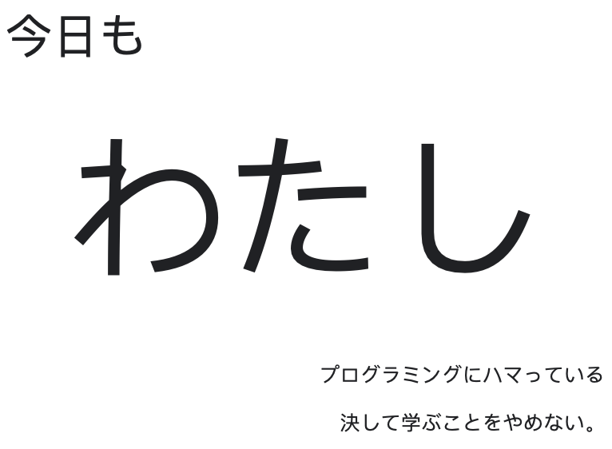

# today

[![npm version][npm-version-src]][npm-version-href]
[![npm downloads][npm-downloads-src]][npm-downloads-href]
[![bundle][bundle-src]][bundle-href]
[![JSDocs][jsdocs-src]][jsdocs-href]
[![License][license-src]][license-href]

わたし、気になります！

[简体中文](./README_zh.md) [English](../README_JP.md)

<

  

    
今天

    

      我
    

    

      斟酌每一行代码
    

    

      只因我希望努力做到求知若饥，虚心若愚。
    

  

## License

[MIT](./LICENSE) License © 2024-PRESENT [Xiaoxi Yun](https://github.com/ycte)

<!-- Badges -->

[npm-version-src]: https://img.shields.io/npm/v/today-ycte?style=flat&colorA=080f12&colorB=1fa669
[npm-version-href]: https://npmjs.com/package/today-ycte
[npm-downloads-src]: https://img.shields.io/npm/dm/today-ycte?style=flat&colorA=080f12&colorB=1fa669
[npm-downloads-href]: https://npmjs.com/package/today-ycte
[bundle-src]: https://img.shields.io/bundlephobia/minzip/today-ycte?style=flat&colorA=080f12&colorB=1fa669&label=minzip
[bundle-href]: https://bundlephobia.com/result?p=today-ycte
[license-src]: https://img.shields.io/github/license/ycte/today.svg?style=flat&colorA=080f12&colorB=1fa669
[license-href]: https://github.com/ycte/today/blob/main/LICENSE
[jsdocs-src]: https://img.shields.io/badge/jsdocs-reference-080f12?style=flat&colorA=080f12&colorB=1fa669
[jsdocs-href]: https://www.jsdocs.io/package/today-ycte
